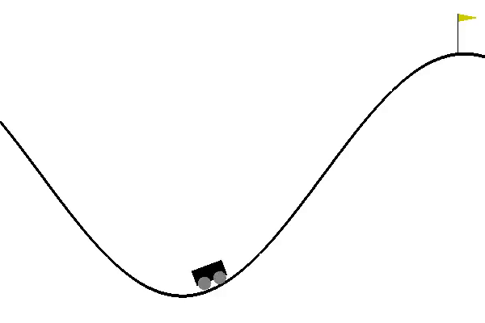

# Model Free Deep Reinforcement Learning

This repository contains Temporal Difference Learning and it's variants. In particular, there is Deep Q-Learning, in combination with different training tricks like Experience Replay, Dueling and Double Q-Networks. The Open AI Gym environments used are Cartpole-v0, MountainCar-v0 and SpaceInvaders-v0.

Requirements:
1. TensorFlow
2. Keras
3. PyTorch
4. Open AI Gym

Sample Results:

