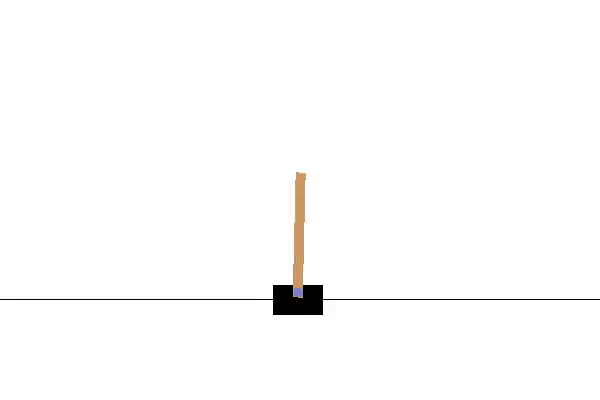

# Model Free Deep Reinforcement Learning

This repository contains Temporal Difference Learning and it's variants. In particular, there is Deep Q-Learning, in combination with different training tricks like Experience Replay, Dueling and Double Q-Networks. The Open AI Gym environments used are Cartpole-v0, MountainCar-v0 and SpaceInvaders-v0. This was implemented as part of the course 10703 (Deep Reinforcement Learning and Control) at CMU.

Requirements:

1. TensorFlow
2. Keras
3. PyTorch
4. Open AI Gym

Implementation structure is as follows-

Model	ExpReplay[Y/n]	Env		API

Linear	w/o ExpReplay	MC		PyTorch
					 	          CP 		PyTorch

Linear 	w/ ExpReplay	MC		Keras
						          CP 		Keras

DQN 	w/ ExpReplay	MC		Keras
					        	CP 		Keras

Dueling w/ ExpReplay	MC		Keras
						          CP 		Keras

Atari	w/ ExpReplay 			Pytorch

Usage:

Run the following command-

python DQN_Implementation.py with the following arguments-
	--env=ENVIRONMENT_NAME		-for example- CartPole-v0, MountainCar-v0, SpaceInvaders-v0
	--render=1 OR 0 		-variable to enable render(1) or not(0)
	--train=1 OR 0			-variable to train(1) the model or not(0)
	--type=MODEL_TYPE		-Model type- linear,linear-exp,DQN,Dueling,Atari
	--save_folder=FOLDER_DIR	-folder directory to save videos (Optional). Videos are not saved if nothing is given
	--model_file=FILE_DIR		-File directory of saved model(Optional). Nothing is done if not given
 

HyperParameters have been sectioned for easy alteration. You should be able to locate them easily by just searching 'Hyper' adn alter them as per your convenience.

Sample Results:

